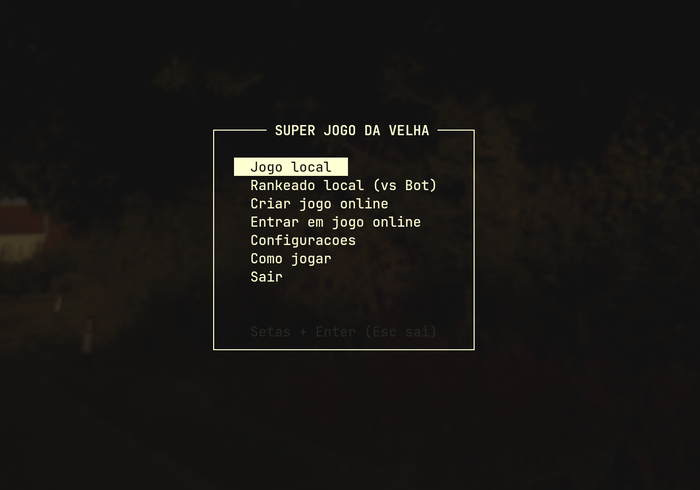
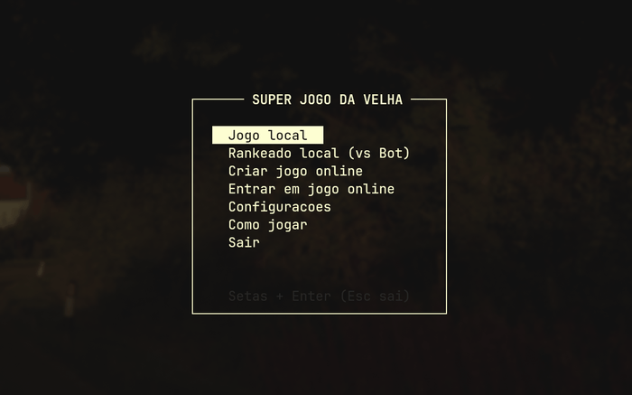
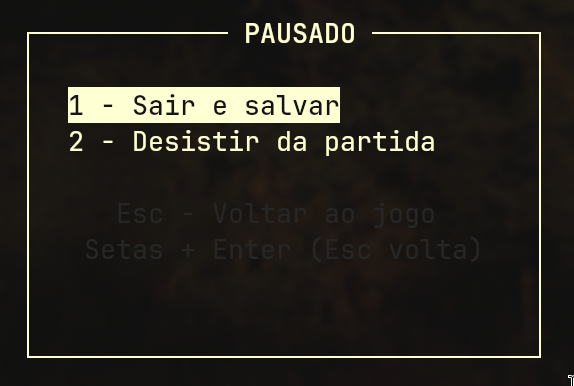
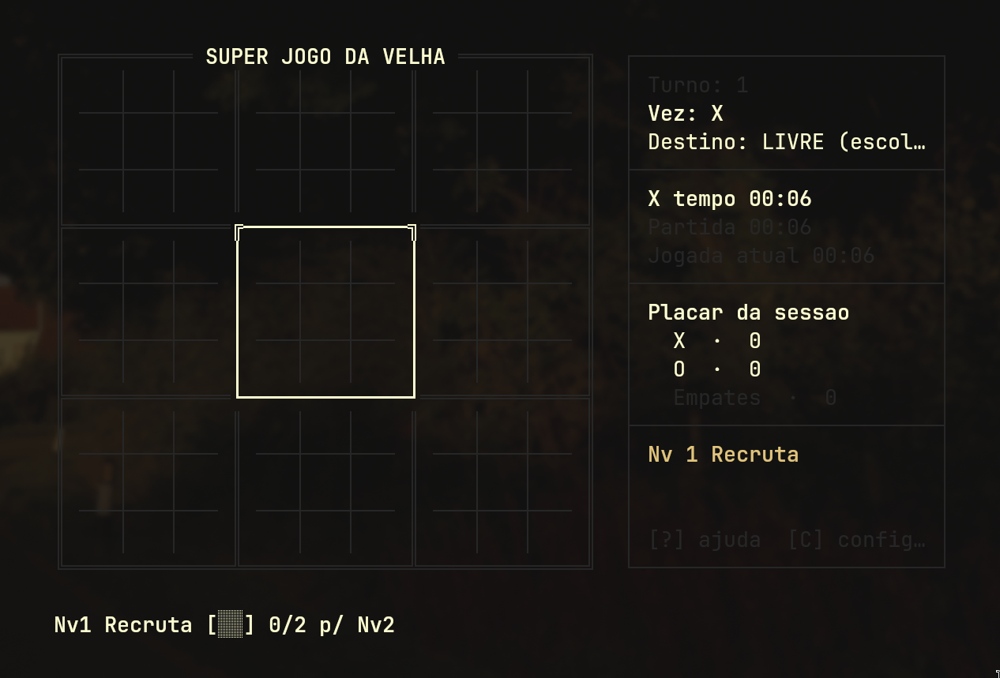

# Super Jogo da Velha

<p align="center">
  
  
</p>

O clássico jogo da velha, mas **nove vezes mais estratégico**. No Super Jogo da Velha, cada casa do tabuleiro esconde um jogo completo: para vencer a partida, você precisa vencer três desses tabuleiros em linha. Cada jogada sua define **qual tabuleiro o adversário vai atacar em seguida** — antecipar os próximos movimentos é tão importante quanto executar o seu. Tudo direto no terminal, sem tela gráfica: só **X**, **O** e estratégia.

<div align="center">
  
</div>

---

## 🆕 Novidades

- **Modo Rankeado local (vs Bot)** — progressão do Nv1 ao Nv10, com nomes de bot por nível, barra de progresso no HUD e vidas no Nv10.

<div align="center">
  
  <br>
  <sup><em>Demonstração do modo Rankeado.</em></sup>
</div>

- **Modo Online em LAN** — criar/entrar com senha, descoberta automática na rede, nick por jogador, revanche e aviso de saída/queda.
<div align="center">
  
  
</div>

- **Menu de pausa (`Esc`)** — no Local e no Rankeado o `Esc` abre `PAUSADO` com `Sair e salvar` ou `Desistir da partida` (no Online o `Esc` continua saindo direto).
<div align="center">
  
</div>

- **Salvar e continuar** — `Sair e salvar` grava em `~/.superjogo/save-local.dat` ou `save-ranked.dat`; ao entrar no modo o jogo pergunta `Continuar` ou `Nova partida`.
- **Online mais seguro** — validação da jogada recebida (posição, peça e placar recalculados), filtro de desserialização e senha/TLS renovados.
- **Tradução PT/EN** — escolha de idioma no início, com textos do HUD e telas traduzidos.

---

## ✨ Destaques

- **Interface limpa** — Jogue direto no seu terminal (CLI), sem distrações.
- **Lógica avançada** — Implementação completa das regras oficiais do Ultimate Tic-Tac-Toe.
- **Três modos** — Local (2 jogadores), Rankeado (vs Bot) e Online em LAN.
- **Multiplataforma** — Roda perfeitamente em Windows, Linux e macOS.

## Como jogar

O jogo funciona em duas camadas:

- **Tabuleiro grande (3×3)** — cada uma das 9 casas é um jogo da velha individual.
- **Tabuleiros pequenos (3×3)** — dentro de cada casa, você disputa um jogo da velha normal.

A jogada em uma casa do tabuleiro pequeno **determina qual tabuleiro grande o adversário vai jogar em seguida**. Vencer três tabuleiros pequenos em linha (horizontal, vertical ou diagonal) vence a partida.

> **⚠️ Se o seu adversário te mandar para um tabuleiro que já foi ganho ou que está empatado (cheio), você ganha o direito de jogar em qualquer tabuleiro livre!**

> **⚠️ Um tabuleiro empatado não será contabilizado para nenhum dos jogadores e, portanto, será ignorado para o resultado final!**

## Modos de jogo

- **Jogo local** — 2 jogadores no mesmo terminal. Escolha `X`/`O` no início, revanche alterna quem começa e o placar da sessão (`X · O · Empates`) fica no HUD.
- **Rankeado local (vs Bot)** — você contra o bot em 10 níveis (Nv1–Nv5: 2 vitórias para subir; Nv6–Nv9: 3 vitórias; Nv10: sequência + 3 vidas). Derrota tira 1 vitória, empate não muda nada. O HUD mostra `Nv`, progresso e, no Nv10, sequência/vidas.
- **Online em LAN** — um lado cria com senha, o outro entra (descoberta automática na rede local). Cada um escolhe o nick, o HUD mostra de quem é a vez pelo nick, e o jogo valida cada lance recebido. Revanche, aviso de saída (`QUIT`) e detecção de queda com heartbeat.

## Controles

| Tecla           | Ação                                            |
| --------------- | ----------------------------------------------- |
| `←` `→` `↑` `↓` | Navegar entre casas / jogos                     |
| `Enter`         | Confirmar a seleção / fazer a jogada            |
| `Esc`           | Pausar (Local/Rankeado) ou sair (Online/menus)  |
| `?` / `H`       | Abrir/fechar ajuda                              |
| `C`             | Abrir configurações (nick/idioma/reset de rank) |
| `R`             | Revanche na tela final                          |
| `X` / `O`       | Escolher sua peça no início do jogo local       |
| `1` / `2`       | Escolher idioma ou opção nos menus              |

## Pausar, salvar e desistir (Local/Rankeado)

Apertar `Esc` no meio da partida abre o menu `PAUSADO`:

- **Sair e salvar** — grava a partida e volta ao menu. Na próxima entrada o jogo pergunta `[S]im continuar / [N]ao nova partida`.
- **Desistir** — encerra com derrota (no Local perde quem tem a vez; no Rankeado perde o humano) e mostra a tela final normalmente.
- **Voltar (`Esc`)** — continua de onde parou, sem salvar.

Os saves ficam em `~/.superjogo/save-local.dat` e `~/.superjogo/save-ranked.dat`. Se o save estiver corrompido, o jogo avisa e começa uma nova partida. Terminar a partida (vitória/empate/desistência) apaga o save.

<div align="center">
  
</div>

## Como baixar e jogar

Baixe a versão mais recente na página de [releases](https://github.com/Campeol-G/SuperJogoDaVelha/releases).

### Opção 1 — Instaladores e versão portátil

| Sistema | Arquivo                                 | Instalação                                             |
| ------- | --------------------------------------- | ------------------------------------------------------ |
| Windows | `SuperJogoDavelha-portable-windows.zip` | Extraia o `.zip` e execute o `SuperJogoDavelha.exe`    |
| Linux   | `SuperJogoDavelha-linux.deb`            | `sudo dpkg -i SuperJogoDavelha-linux.deb`              |
| macOS   | `SuperJogoDavelha-macos.dmg`            | Abra o `.dmg` e arraste o app para a pasta Aplicativos |

### Opção 2 — Rodar direto do JAR (sem instalar)

Baixe o arquivo `SuperJogoDavelha.jar` e execute:

```bash
java -jar SuperJogoDavelha.jar
```

> **Requisito:** Java 21 ou superior.

> O jogo roda em um terminal com suporte a cores ANSI (ex.: Windows Terminal, iTerm2, GNOME Terminal). No Prompt de Comando/PowerShell antigo do Windows, execute `chcp 65001` antes de rodar para que os caracteres de borda (║ ═ ╬) sejam exibidos corretamente.

## Compilando a partir do código-fonte

**Pré-requisitos:** JDK 21+ e Maven.

```bash
# Compila e gera o JAR executável
mvn package

# Executa o jogo
java -jar target/SuperJogoDavelha.jar
```

O Maven gera um **fat JAR** (todas as dependências empacotadas) em `target/SuperJogoDavelha.jar`.

> **Nota (desenvolvimento):** o modo online usa TLS com certificados autoassinados **descartáveis** (`src/main/resources/*.p12`, senha pública no `SslUtil`). Eles são versionados de propósito — sem eles no JAR, o online falha. Nunca reutilize esses certificados/senha fora deste projeto.

> Os instaladores (`.deb` e `.dmg`) e a versão portátil do Windows (`.zip`) são gerados automaticamente pelo GitHub Actions para Linux, macOS e Windows a cada release.
