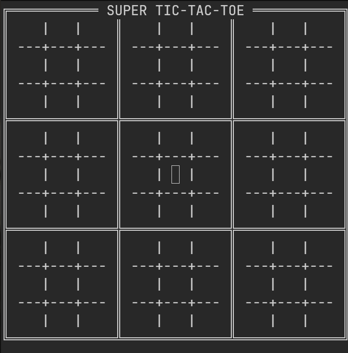

# Super Jogo da Velha

<p align="center">
  
  
</p>

O clássico jogo da velha, mas **nove vezes mais estratégico**. No Super Jogo da Velha, cada casa do tabuleiro esconde um jogo completo: para vencer a partida, você precisa vencer três desses tabuleiros em linha. Cada jogada sua define **qual tabuleiro o adversário vai atacar em seguida**, antecipar os próximos movimentos é tão importante quanto executar o seu. Tudo direto no terminal, sem tela gráfica: só **X**, **O** e estratégia.

<div align="center">
  
  <br>
  <sup><em>Demonstração de uma partida em andamento no terminal.</em></sup>
</div>

---

## ✨ Destaques

- **Interface Limpa:** Jogue direto no seu terminal (CLI) sem distrações.
- **Lógica Avançada:** Implementação completa das regras oficiais do Ultimate Tic-Tac-Toe.
- **Multiplataforma:** Roda em Windows, Linux e macOS perfeitamente.

## Como jogar

O jogo funciona em duas camadas:

- **Tabuleiro grande (3×3):** cada uma das 9 casas é um jogo da velha individual.
- **Tabuleiros pequenos (3×3):** dentro de cada casa, você disputa um jogo da velha normal.

A jogada em uma casa do tabuleiro pequeno **determina qual tabuleiro grande o adversário vai jogar em seguida**. Vencer três tabuleiros pequenos em linha (horizontal, vertical ou diagonal) vence a partida.

> **⚠️ Se o seu adversário te mandar para um tabuleiro que já foi ganho ou que está empatado (cheio), você ganha o direito de jogar em qualquer tabuleiro livre**!

> **⚠️ Um tabuleiro empatado não será contabilizado para nenhum dos jogadores e, portanto, será ignorado para o resultado final!**

## Controles

| Tecla           | Ação                                 |
| --------------- | ------------------------------------ |
| `←` `→` `↑` `↓` | Navegar entre casas / jogos          |
| `Enter`         | Confirmar a seleção / fazer a jogada |
| `Esc`           | Interromper a partida e sair         |
| `X` / `O`       | Escolher sua peça no início do jogo  |

## Como baixar e jogar

Baixe a versão mais recente na página de [releases](https://github.com/Campeol-G/SuperJogoDaVelha/releases).

### Opção 1 — Instalador

| Sistema | Arquivo                        | Instalação                                             |
| ------- | ------------------------------ | ------------------------------------------------------ |
| Windows | `SuperJogoDavelha-windows.exe` | Execute o instalador e siga o assistente               |
| Linux   | `SuperJogoDavelha-linux.deb`   | `sudo dpkg -i SuperJogoDavelha-linux.deb`              |
| macOS   | `SuperJogoDavelha-macos.dmg`   | Abra o `.dmg` e arraste o app para a pasta Aplicativos |

### Opção 2 — Rodar direto do JAR (sem instalar)

Baixe o arquivo `SuperJogoDavelha.jar` e execute:

```bash
java -jar SuperJogoDavelha.jar
```

> **Requisito:** Java 21 ou superior.

> O jogo roda em um terminal com suporte a cores ANSI (ex.: Windows Terminal, iTerm2, GNOME Terminal). No Prompt de Comando/PowerShell antigo do Windows, execute `chcp 65001` antes de rodar para que os caracteres de borda (║ ═ ╬) sejam exibidos corretamente.

## Compilando a partir do código-fonte

**Pré-requisitos:** JDK 21+ e Maven.

```bash
# Compila e gera o JAR executável
mvn package

# Executa o jogo
java -jar target/SuperJogoDavelha.jar
```

O Maven gera um **fat JAR** (todas as dependências empacotadas) em `target/SuperJogoDavelha.jar`.

> Os instaladores (`.exe`, `.deb` e `.dmg`) são gerados automaticamente pelo GitHub Actions para Windows, Linux e macOS a cada release.
